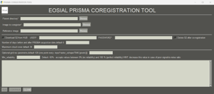

# EOSIAL_PCRT
Software solution designed for the coregistration of data from the PRISM Italian hyperspectral satellite, a key component of the Lab of Remote Sensing Satellite Images Applications.
You can downoload the executable file in the shared Google Drive directory: https://drive.google.com/file/d/13KOnGXSjyXE4aXpsHsz48oog3oMfRxbX/view?usp=drive_link.

